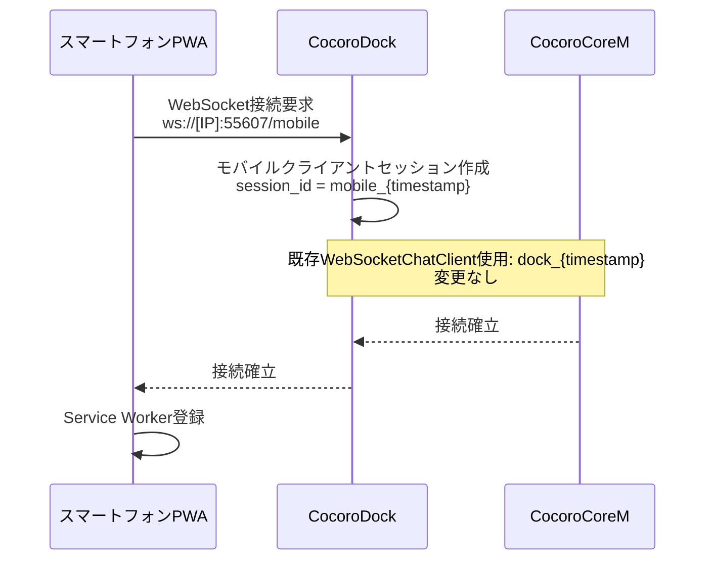
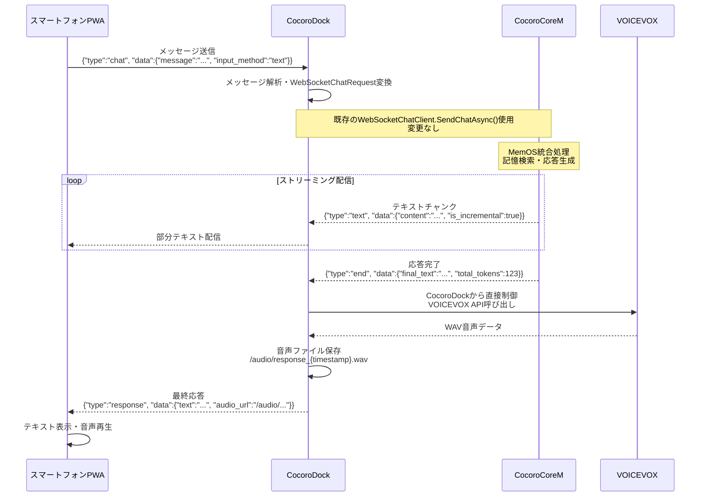
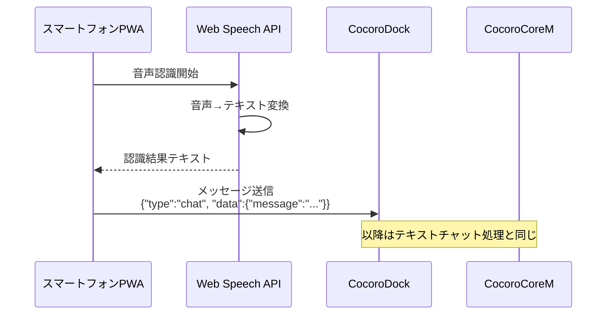
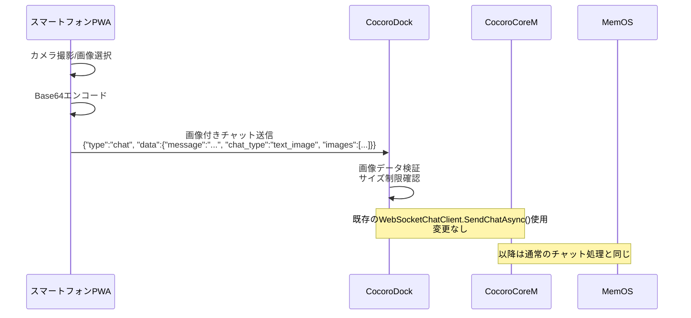
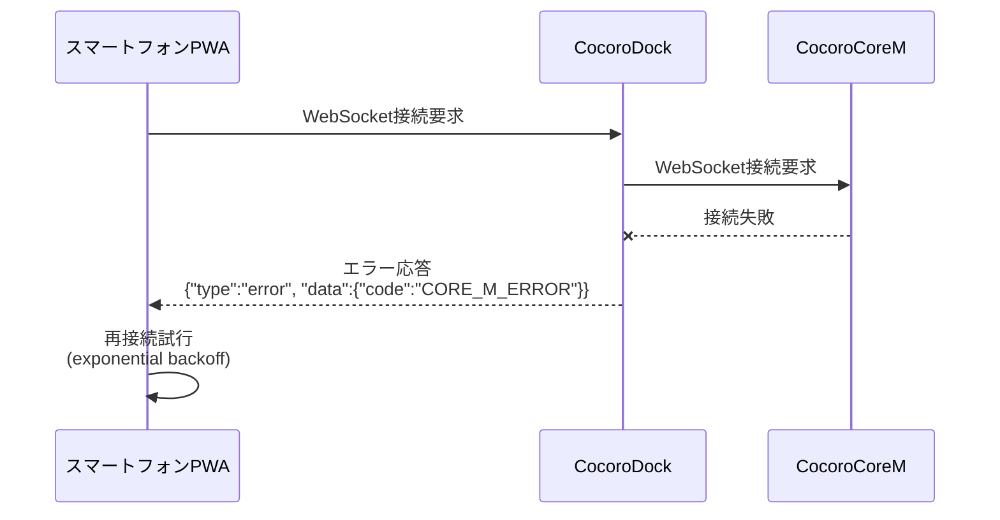
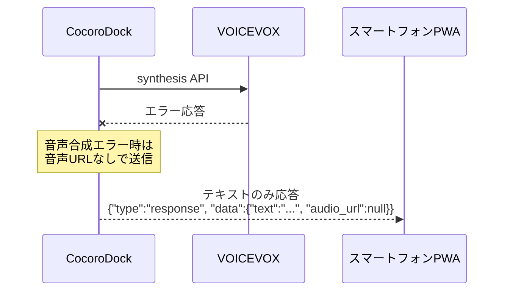

# CocoroAI Web対応処理シーケンス仕様書

## 1. 概要

本文書は、CocoroAI Web対応における各コンポーネント間の詳細な処理シーケンスを定義します。  
スマートフォンPWAからの各種リクエストが、どのように処理され応答が返されるかを明確化します。

## 2. システム構成

### コンポーネント配置
```
┌─────────────────┐
│  スマートフォン  │ (PWA)
│   Web Browser   │
└────────┬────────┘
         │ WebSocket (ws://[IP]:55607/mobile)
         ↓
┌─────────────────┐
│   CocoroDock    │ (中央制御ハブ) :55607
├─────────────────┤
│ WebSocketServer │ ← 新規実装
│ WebSocketClient │ ← 既存利用
└────────┬────────┘
         │ 既存WebSocketChatClient通信: dock_{timestamp}（変更なし）
         ↓
┌─────────────────┐
│  CocoroCoreM    │ (AI処理) :55601
├─────────────────┤
│  MemOS統合      │
│  MOSProduct     │
└─────────────────┘

┌─────────────────┐
│   VOICEVOX      │ (音声合成) :50021 ← CocoroDockから直接制御
└─────────────────┘
```

## 3. 基本処理フロー

### 3.1 接続確立シーケンス


### 3.2 テキストチャット処理シーケンス


### 3.3 音声入力処理シーケンス



### 3.4 画像付きチャット処理シーケンス


## 4. データフロー詳細

### 4.1 WebSocketメッセージ構造

#### スマートフォン → CocoroDock

**チャットメッセージ**
```json
{
  "type": "chat",
  "timestamp": "2025-09-13T10:00:00Z",
  "data": {
    "message": "今日の天気を教えて"
  }
}
```

**画像付きチャットメッセージ**
```json
{
  "type": "chat",
  "timestamp": "2025-09-13T10:00:00Z",
  "data": {
    "message": "この画像について教えて",
    "chat_type": "text_image",
    "images": [
      {
        "image_data": "data:image/jpeg;base64,/9j/4AAQ...",
        "source": "camera|gallery"
      }
    ]
  }
}
```

※音声入力もテキスト変換後は通常の「chat」タイプメッセージとして処理


#### CocoroDock → スマートフォン

**応答メッセージ**
```json
{
  "type": "response",
  "timestamp": "2025-09-13T10:00:15Z",
  "data": {
    "text": "AIからの応答テキスト",
    "audio_url": "/audio/response_20250913100015.wav",
    "speaker_id": 3,
    "source": "cocoro_core_m"
  }
}
```

**エラーメッセージ**
```json
{
  "type": "error",
  "timestamp": "2025-09-13T10:00:15Z",
  "data": {
    "code": "VOICEVOX_ERROR|CORE_M_ERROR|NETWORK_ERROR",
    "message": "エラー詳細メッセージ"
  }
}
```

### 4.2 VOICEVOX API呼び出しフロー
```
1. audio_query API
   POST http://localhost:50021/audio_query?text={text}&speaker={speakerId}
   → AudioQuery JSON取得

2. synthesis API  
   POST http://localhost:50021/synthesis?speaker={speakerId}
   Body: AudioQuery JSON
   → WAV音声データ取得

3. ファイル保存
   Path: wwwroot/audio/response_{timestamp}.wav
   
4. URL生成
   /audio/response_{timestamp}.wav
```

## 5. セッション管理

### 5.1 セッションID体系

| レベル | ID形式 | 説明 |
|--------|--------|------|
| PWA-Dock | mobile_{timestamp} | モバイル接続識別 |
| Dock-Core | dock_{timestamp} | 既存WebSocketChatClient利用 |
| MemOS | user_user_{memoryId}_cube | 既存キューブ識別機能 |

### 5.2 セッション継続性とMemOS統合

- **CocoroDock-CocoreCoreM間**: 既存のWebSocketChatClient通信をそのまま継続（変更なし）
- **CocoroCoreM側**: 既存のセッション管理機能をそのまま使用
  - `app.cocoro_product.current_user_id`: キャラクター別論理分離
  - `app.cocoro_product.get_current_cube_id()`: MemOSキューブ識別
  - モバイル専用の新機能は一切追加しない
- **MemOS TreeTextMemory**: キューブ単位で会話履歴を自動保存
- **記憶システム**: PersonalMemory/OuterMemoryがキューブIDに基づいて継続

## 6. エラー処理シーケンス

### 6.1 接続エラー



### 6.2 VOICEVOX エラー



## 7. 実装制約事項と前提条件

### 7.1 CocoroCoreM側の変更不要の理由

- **既存WebSocket API活用**: CocoroCoreM は標準的な WebSocket チャットAPI を提供
- **MemOSセッション管理**: キューブIDによる自動的なセッション継続機能を内蔵
- **汎用的な設計**: モバイル専用機能は不要、既存の機能で十分対応可能

### 7.2 実装における技術的制約

- **ポート競合**: 55603番は既に `cocoroMemoryDBPort` で使用済み → **55607番を使用**
- **WebSocketClient**: 既存の `WebSocketChatClient` クラスをそのまま活用
- **VOICEVOX依存**: 音声合成機能にはVOICEVOX起動が必須
- **設定ファイル**: `setting.json` に `cocoroWebPort: 55607` と `isEnableWebService: true` の追加が必要

### 7.3 MemOS統合における注意点

- **キャラクター選択**: `currentCharacterIndex` に基づく `memoryId` の自動設定
- **記憶継続性**: TreeTextMemory によるキューブ単位での会話履歴管理
- **ユーザー分離**: `current_user_id` によるキャラクター別論理分離

## 8. テスト・検証手順

### 8.1 接続テスト

1. CocoroDock の WebSocket サーバー起動確認 (ポート55607)
2. スマートフォンからの WebSocket 接続確認
3. CocoroCoreM への WebSocket プロキシ動作確認

### 8.2 機能テスト

1. **テキストチャット**: メッセージ送受信とストリーミング配信
2. **音声入力**: Web Speech API → テキスト変換 → チャット処理
3. **画像送信**: Base64エンコード → WebSocket転送 → AI画像解析
4. **音声合成**: VOICEVOX API → WAVファイル生成 → URL配信

### 8.3 エラーハンドリングテスト

1. VOICEVOX 未起動時の音声合成エラー処理
2. CocoreCoreM 接続断時の再接続機能
3. 大容量画像送信時の制限処理
---

**End of Document**